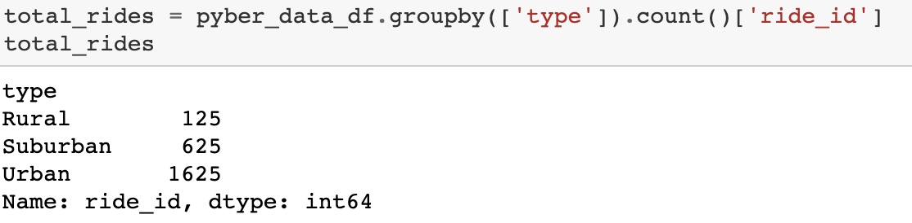
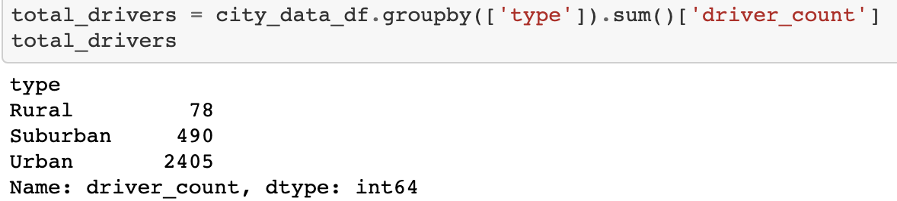
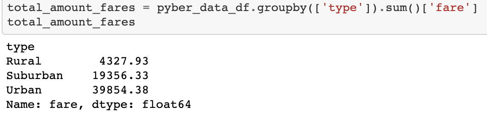
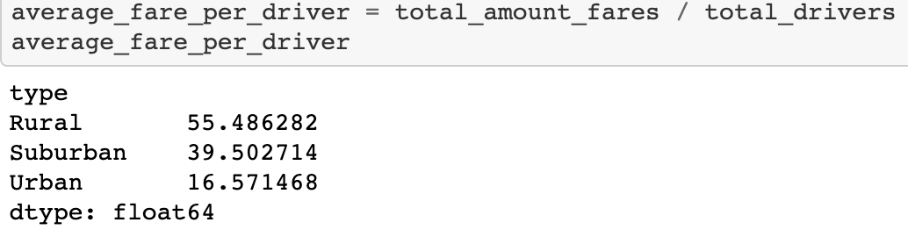
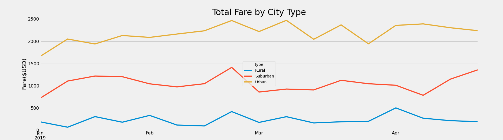

# PyBer_Analysis
## Overview of the analysis: Explain the purpose of the new analysis.

The main task is to prepare a summary DataFrame of the ride-sharing data by city type. There are 3 city types: urban, suburban and rural. Then, create a multiple-line graph that shows the total weekly fares for each city type. 

## Results:  
### 1. Loading and Reading CSV files. 
There were two csv files loaded in Resources folder: city_data and ride_data.

### 2. Merge the DataFrames.

Combine the data into a single dataset. Merge ride_data_df and city_data_df into pyber_data_df.

### 3. Get a Summary DataFrame.

I found the total number of rides, total number of drivers, and the total fares for each city type. 

Please see below:

Total number of rides:

Total number of drivers:

Total amount of fares for each city type:

Then, I calculated the average fare per ride and per driver for each city type. 

The average fare per ride:

The average fare per driver:

PyBer summary DataFrame:

The differences in ride-sharing data among the different city types:

Rural city type had the highest average per ride $34.62 and the highest average fare per driver $55.49 compare with other city types. It had only 78 drivers with 125 rides. That is why this city type had the lowest total fares amount $4,327.93. These fares amount 4.5 times less than in Suburban city type and 9.2 times less than in Urban city type. The most successful week was in April.

Suburban city type had more drivers and rides than in Rural, 490 drivers with 625 rides. Average fare per ride was $30.97, which is less by $3.65 compare to Rural city type and more by $6.44 than in Urban city type. The average fare per driver was $39.50. The most successful month was February.

Urban had the most successful data results. It had the largest number of drivers 2,405 with total rides 1,625. It is the largest market with the lowest average fare per ride $24.53 and average per driver $16.57. It had high peak season in February and March.

## Summary: 

My three business recommendations to the CEO for addressing disparities among the city types are:

1. Investigate Rural city type. Why the total amount of fares so low? There might be lack of promotion of PyBer services in Rural city types compare to bigger cities.

2. Increase a price per ride during high peak season in each city types in order to make some profit.

3. Create new services: food, grocery delivery, carpool and etc. in order to provide more work rides for current drivers. 

