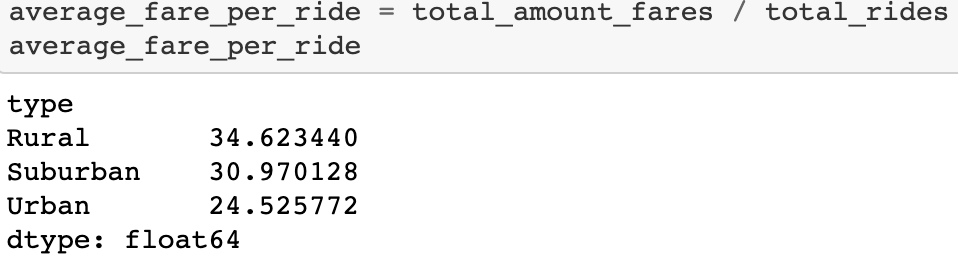

# PyBer_Analysis
## Overview of the analysis: Explain the purpose of the new analysis.

The main task is to prepare a summary DataFrame of the ride-sharing data by city type. There are 3 city types: urban, suburban and rare. Then, create a multiple-line graph that shows the total weekly fares for each city type. 

## Results: Using images from the summary DataFrame and multiple-line chart, describe the differences in ride-sharing data among the different city types.

### 1. Loading and Reading CSV files. 
There were two csv files loaded in Resources folder: city_data and ride_data.

### 2. Merge the DataFrames.

Combine the data into a single dataset. Merge ride_data_df and city_data_df into pyber_data_df.

### 3. Get a Summary DataFrame.

I found the total number of rides, total number of drivers, and the total fares for each city type. 

Please see below:

Total number of rides:

Total number of drivers:

Total amount of fares for each city type:

Then, I calculated the average fare per ride and per driver for each city type. 

The average fare per ride:

The average fare per driver:

PyBer summary DataFrame:

- There is a description of the differences in ride-sharing data among the different city types. Ride-sharing data include the total rides, total drivers, total fares, average fare per ride and driver, and total fare by city type. (7 pt)

## Summary: Based on the results, provide three business recommendations to the CEO for addressing any disparities among the city types.

There is a statement summarizing three business recommendations to the CEO for addressing any disparities among the city types. (4 pt)